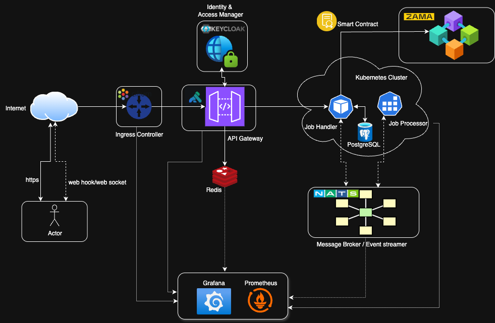

# Zama Jobs API - Architecture Document

## Table of Contents

- [1. Executive Summary](#1-executive-summary)
- [2. Architecture Decision Pack](#2-architecture-decision-pack)
  - [2.1 Problem Statement](#21-problem-statement)
  - [2.2 ADR-000: High-Level Architecture](#22-adr-000-high-level-architecture)
  - [2.3 ADR-001: API Governance and Design](#23-adr-001-api-governance-and-design)
  - [2.4 ADR-002: Authentication & Authorization](#24-adr-002-authentication-and-authorization)
  - [2.5 ADR-003: Rate Limiting & Quotas](#25-adr-003-rate-limiting--quotas)
  - [2.6 ADR-004: Blockchain Integration](#26-adr-004-blockchain-integration)
  - [2.7 ADR-005: Metering & Billing](#27-adr-005-metering--billing)
- [3. System Interface & Logic](#3-system-interface--logic)
  - [3.1 API Specification](#31-api-specification)
  - [3.2 API Handler Logic](#32-api-handler-logic)
  - [3.3 Alternative: gRPC Interface](#33-alternative-grpc-interface-future-consideration)
  - [3.4 Job Handler Implementation Overview](#34-job-handler-implementation-overview)
  - [3.5 Job Processor Overview](#35-job-processor-overview)
  - [3.6 Smart Contract Interface](#36-smart-contract-interface)
  - [3.7 Technology Stack Rationale](#37-technology-stack-rationale)
- [4. Reliability & Security](#4-reliability--security)
  - [4.1 Reliability Engineering](#41-reliability-engineering)
  - [4.2 Security Architecture](#42-security-architecture)
- [5. Operational Excellence](#5-operational-excellence)
  - [5.1 Data Retention and Archival Policies](#51-data-retention-and-archival-policies)
  - [5.2 Disaster Recovery Procedures](#52-disaster-recovery-procedures)
  - [5.3 Circuit Breaker Implementation](#53-circuit-breaker-implementation)
  - [5.4 Observability Stack](#54-observability-stack)
  - [5.5 Testing & Quality Assurance](#55-testing--quality-assurance)
  - [5.6 Compliance & Governance](#56-compliance--governance)
- [6. Cost Analysis & Optimization](#6-cost-analysis--optimization)
  - [6.1 Infrastructure Cost Breakdown](#61-infrastructure-cost-breakdown)
- [7. Conclusion](#7-conclusion)

---

## 1. Executive Summary

This document presents a comprehensive platform architecture that bridges traditional web infrastructure with blockchain integration through a secure, governed API gateway and minimal on-chain interface. The design prioritizes architectural coherence, security-by-default principles, and operational reliability while demonstrating mature thinking around API governance, usage metering, and scalability.

The proposed solution addresses the core challenge of building a production-ready platform that balances the flexibility demands of modern API consumers with the immutability constraints of on-chain operations. 


---

## 2. Architecture Decision Pack

### 2.1 Problem Statement

This architecture defines a RESTful interface enabling developers to submit long-running asynchronous jobs, with final job confirmations recorded on an immutable EVM-compatible Layer 1 blockchain.

**Key challenges include:**
- Ensuring API governance (consistent endpoint structure, versioning, error handling, and idempotency)
- Enforcing platform policies (secure authentication, rate limiting, quotas, and abuse prevention)
- Metering logic for capturing usage for billing
- Managing asynchronous job lifecycle without blocking operations
- Bridging Web2 API patterns with Web3 blockchain finality

**Key architectural decisions include:**
- **API Gateway Design**: A layered gateway approach with rate limiting, authentication, and request validation that provides fine-grained control over platform access while maintaining performance at scale
- **On-Chain Interface Minimization**: A lean smart contract surface area that reduces attack vectors, gas costs, and upgrade complexity while maximizing verification transparency
- **Security Posture**: Defense-in-depth strategy with zero-trust principles, cryptographic verification at boundaries, and comprehensive audit logging
- **Metering & Governance**: Usage-based resource allocation with tiered access controls, enabling both fair-use policies and commercial monetization paths 

The API must handle job submission, status querying, and ensure reliability without synchronous blocking, while the blockchain interface confirms completions securely. We aim for a design that prioritizes security-by-default, reliability, and metering to support usage-based billing.


### 2.2 ADR-000: High-Level Architecture

---


---

### 2.3 ADR-001: API Governance and Design

**Status**: Accepted

**Context**: Need a robust, versioned REST API supporting long-running jobs with idempotency and comprehensive error handling.

**Options Considered**:
1. **REST API with path versioning**: Clear, cache-friendly, widely understood
2. **GraphQL**: Flexible queries but complex for async operations
3. **gRPC**: Performance benefits but less accessible for external developers

**Decision**: REST API with path-based versioning

#### API Structure
- **Versioning**: Path-based (`/v1/`, `/v2/`) for clarity and cache-friendliness
- **Resource Design**: RESTful endpoints following standard conventions
  - `POST /v1/jobs` - Submit job (returns 202 Accepted)
  - `GET /v1/jobs/{jobId}` - Get job details
  - `GET /v1/jobs/{jobId}/status` - Lightweight status check
  - `POST /v1/jobs/{jobId}/cancel` - Request cancellation
  - `GET /v1/jobs` - List tenant's jobs (paginated)
  - `GET /v1/jobs/subscribe` - Websocket endpoint to get job status in realtime

#### API Version Migration Strategy
- **Deprecation Notice**: 6 months minimum advance notice via:
  - `Deprecation` header in API responses
  - Email notifications to registered developers
  - Dashboard warnings in developer portal
- **Sunset Period**: 12 months after deprecation announcement
- **Migration Support**:
  - Automated migration tools for common patterns
  - Side-by-side testing capability
  - Migration guides with code examples
- **Backward Compatibility**:
  - Support for 2 major versions simultaneously
  - Feature flags for gradual rollout
  - Response format negotiation via `Accept-Version` header
- **Version Lifecycle**:
  ```
  v1: Active (current)
  v2: Beta (6 months) → Active (12+ months) → Deprecated (6 months) → Sunset
  ```

#### Idempotency Strategy
- **Mechanism**: Required `Idempotency-Key` header (UUID v4)
- **Storage**: Redis with 24-hour TTL
- **Scope**: Per tenant+endpoint combination
- **Key Format**: `hash(tenant_id + endpoint_path + idempotency_key)`

#### Error Model
- **Format**: RFC 7807 Problem Details (application/problem+json)
- **Structure**:
```json
{
  "type": "https://api.zama.ai/errors/validation-error",
  "title": "Validation Failed",
  "status": 422,
  "detail": "Job parameters failed validation",
  "instance": "/v1/jobs",
  "trace_id": "550e8400-e29b-41d4-a716-446655440000",
  "errors": [
    {"field": "parameters.timeout", "message": "must be between 60 and 86400"}
  ]
}
```

**Consequences**:
- **Positive**:
  - Clear versioning reduces breaking changes impact
  - Idempotency prevents duplicate work
  - Industry-standard REST patterns reduce learning curve
  - Cache-friendly URL structure
- **Negative**:
  - Additional Redis dependency for idempotency storage

---

### 2.4 ADR-002: Authentication and Authorization

**Status**: Accepted

**Context**: Require secure Machine-to-Machine authentication with fine-grained permissions.

**Options Considered**:
1. **OAuth 2.0 with JWT**: Industry standard, stateless validation
2. **API Keys**: Simple but less secure, harder to rotate
3. **mTLS**: Very secure but complex certificate management
4. **Basic Auth**: Simple username/password but unsuitable for production Machine-to-Machine (M2M)

**Decision**: OAuth 2.0 Client Credentials Flow with JWT tokens

#### Authentication
- **Protocol**: OAuth 2.0 Client Credentials Flow
- **Provider**: Keycloak with JWT tokens
- **Token Expiry**: 15 minutes (no refresh tokens for M2M)
- **Validation**: Kong validates JWT using JWKS from Keycloak

#### JWT Claims Structure
```json
{
  "sub": "client_abc123",
  "tenant_id": "tenant-456",
  "scope": "jobs:submit jobs:read",
  "iss": "https://auth.zama.ai/realms/zama",
  "exp": 1728123456,
  "iat": 1728122556
}
```

#### Authorization Scopes
- `jobs:submit` - Create new jobs
- `jobs:read` - Read own tenant's jobs
- `jobs:cancel` - Cancel jobs
- `jobs:admin` - Administrative operations

**Consequences**:
- **Positive**:
  - Industry standard OAuth 2.0 widely understood
  - Short token expiry (15 min) limits breach impact
  - Fine-grained scopes enable least-privilege access
  - Centralized authentication via Keycloak
- **Negative**:
  - Requires Keycloak operational overhead
  - No offline access without refresh tokens 
    - clients must re-authenticate every 15 minutes, requiring constant connectivity to auth server
  - Token refresh complexity for long-running operations 
    - jobs may outlive token validity, requiring careful handling of auth renewal during job lifecycle

---

### 2.5 ADR-003: Rate Limiting & Quotas

**Status**: Accepted

**Context**: Prevent abuse while enabling legitimate high-volume usage.

**Options Considered**:
1. **Token bucket with Redis**: Flexible, allows bursts
2. **Fixed window counters**: Simple but can have edge effects
3. **Sliding window log**: Most accurate but memory intensive

**Decision**: Token bucket algorithm with sliding window fallback

#### Rate Limiting
- **Algorithm**: Token bucket with sliding window
- **Implementation**: Kong rate-limiting plugin + Redis
- **Dual-dimension limiting**: API requests (RPS) and compute resources (CUs)

##### API Rate Limits (Requests Per Second)
- **Free**: 15 RPS
- **Starter**: 150 RPS
- **Pro**: 200 RPS
- **Enterprise**: Custom RPS

##### Compute Unit (CU) Quotas
- **Definition**: 1 CU = 1 KB of payload data processed
- **Job Size Categories**:
  - Small jobs (<100 KB): Min 100 CUs
  - Medium jobs (100 KB - 1 MB): Actual KB count
  - Large jobs (>1 MB): Actual KB + 20% overhead
- **Monthly Allocations**:
  - Free: 15 RPS & 30,000 CUs/month (30 MB of payload data)
  - Starter: 150 RPS & 1,000,000 CUs/month (1 GB of payload data)
  - Pro: 200 RPS & 10,000,000 CUs/month (10 GB of payload data)
  - Enterprise: Custom RPS & Custom CUs (Contact sales)
- **Overage Protection & Billing**:
   - **Soft Limit Buffer** (automatic, no charge):
     - Free: Hard stop at 100% (no overage allowed)
     - Starter: 5% buffer (50,000 CUs grace)
     - Pro: 10% buffer (1,000,000 CUs grace)
     - Enterprise: 15% buffer (negotiated)
   - **Hard Limit Overage** (opt-in, billed):
     - When soft limit exceeded, jobs rejected unless overage billing enabled
     - Overage rate: $0.000005 per CU (5x standard rate)
     - Billed monthly in arrears
   - **Auto-scaling Option**: Automatically upgrade to next tier when 80% utilized

#### Headers and Access Control Logic

**Response Headers Returned on Every API Call:**
```http
# Request rate limits
X-RateLimit-Limit: 5                    # Max requests per second for your tier
X-RateLimit-Remaining: 3                # Requests left in current window
X-RateLimit-Reset: 1728123456           # Unix timestamp when limit resets

# Compute unit limits
X-ComputeUnits-Limit: 100000            # Total monthly CU allocation
X-ComputeUnits-Used: 12568              # CUs consumed this billing period
X-ComputeUnits-Remaining: 87432         # CUs left before hitting limit
X-ComputeUnits-Reset: 1730715456        # Unix timestamp for next billing cycle

# Overage information
X-ComputeUnits-Buffer-Remaining: 10000  # Free buffer CUs remaining
X-ComputeUnits-Overage-Enabled: true    # Whether account allows paid overages
X-ComputeUnits-Overage-Rate: 0.000005   # Price per overage CU in USD

# Retry guidance
Retry-After: 60                          # Seconds to wait before retry (on 429/503)
```

**Access Control Deployment Architecture:**

```yaml
# Two-tier rate limiting strategy
kong_gateway:
  plugins:
    - rate_limiting:  # Coarse-grained RPS limits
        check: request_per_second
        enforcement: immediate_reject_429
    - jwt_validation:
        extract: tenant_id
    - basic_quota:    # Simple quota check
        check: monthly_request_count

job_handler:
  middleware:
    - compute_unit_check:  # Fine-grained CU calculation
        implementation: rust_check_access_function
        reads_from: redis_cache
        calculates: payload_based_CUs
    - billing_events:
        publishes_to: nats_jetstream
```

**Access Control Decision Flow (Runs in Job Handler):**

```rust
use actix_web::{
    http::{StatusCode, header},
    HttpResponse, HttpRequest,
    web::{Json, Bytes},
};
use serde_json::json;

#[derive(Debug)]
struct Tenant {
    current_rps: f32,
    rps_limit: f32,
    cus_used: u64,
    cu_limit: u64,
    buffer_percent: f32,
    overage_enabled: bool,
}

async fn check_access(
    req: HttpRequest,
    body: Bytes,
    tenant: &Tenant,
) -> HttpResponse {
    // Step 1: Check RPS limits
    if tenant.current_rps >= tenant.rps_limit {
        return HttpResponse::build(StatusCode::TOO_MANY_REQUESTS)
            .insert_header(("Retry-After", "60"))
            .insert_header(("X-RateLimit-Remaining", "0"))
            .body("Rate limit exceeded");
    }

    // Step 2: Calculate required CUs for this request
    let required_cus = (body.len() as f64 / 1024.0).ceil() as u64; // KB to CUs

    // Step 3: Check if within primary allocation
    if tenant.cus_used + required_cus <= tenant.cu_limit {
        // Allow request - within normal limits
        return allow_request().await;
    }

    // Step 4: Check if within buffer zone
    let buffer_available = (tenant.cu_limit as f32 * tenant.buffer_percent) as u64;
    if tenant.cus_used + required_cus <= tenant.cu_limit + buffer_available {
        // Allow request - using free buffer
        let buffer_remaining = buffer_available.saturating_sub(
            tenant.cus_used.saturating_sub(tenant.cu_limit)
        );

        return HttpResponse::Accepted()
            .insert_header((
                "X-ComputeUnits-Buffer-Remaining",
                buffer_remaining.to_string()
            ))
            .body("Request accepted");
    }

    // Step 5: Check if overage is enabled
    if !tenant.overage_enabled {
        // Reject - quota exceeded, no overage allowed
        return HttpResponse::build(StatusCode::PAYMENT_REQUIRED)
            .json(json!({
                "error": "Payment Required",
                "message": "Compute unit quota exceeded",
                "upgrade_url": "https://api.zama.ai/upgrade"
            }));
    }

    // Step 6: Check overage limits
    let max_overage = (tenant.cu_limit as f32 * 0.5) as u64; // 50% max overage
    if tenant.cus_used + required_cus > tenant.cu_limit + buffer_available + max_overage {
        // Reject - even with overage, limit exceeded
        return HttpResponse::build(StatusCode::TOO_MANY_REQUESTS)
            .json(json!({
                "error": "Quota Exceeded",
                "message": "Maximum overage limit reached"
            }));
    }

    // Step 7: Allow with overage billing
    let overage_cus = tenant.cus_used + required_cus - tenant.cu_limit - buffer_available;
    let overage_cost = overage_cus as f64 * 0.000005;

    HttpResponse::Accepted()
        .insert_header((
            "X-ComputeUnits-Overage-Applied",
            overage_cus.to_string()
        ))
        .insert_header((
            "X-ComputeUnits-Overage-Cost",
            format!("{:.6}", overage_cost)
        ))
        .body("Request accepted with overage")
}

async fn allow_request() -> HttpResponse {
    HttpResponse::Accepted()
        .body("Request accepted")
}

// Middleware integration example
use actix_web::middleware::from_fn;

pub fn rate_limit_middleware() -> impl Fn(&ServiceRequest) -> impl Future {
    from_fn(|req: ServiceRequest| async move {
        let tenant = extract_tenant_from_jwt(&req).await?;
        let body = req.extract::<Bytes>().await?;

        match check_access(req.request().clone(), body, &tenant).await {
            resp if resp.status().is_success() => {
                // Continue to next handler
                req.call_service().await
            }
            error_response => {
                // Return error response
                Ok(ServiceResponse::new(req.request().clone(), error_response))
            }
        }
    })
}
```

**Client-Side Usage Example:**

```javascript
// Smart client implementation
async function submitJob(jobData) {
    const response = await fetch('/v1/jobs', {
        method: 'POST',
        body: JSON.stringify(jobData)
    });

    // Extract rate limit info
    const rateLimit = {
        remaining: parseInt(response.headers.get('X-RateLimit-Remaining')),
        resetTime: parseInt(response.headers.get('X-RateLimit-Reset'))
    };

    // Extract CU usage info
    const computeUnits = {
        used: parseInt(response.headers.get('X-ComputeUnits-Used')),
        remaining: parseInt(response.headers.get('X-ComputeUnits-Remaining')),
        bufferRemaining: parseInt(response.headers.get('X-ComputeUnits-Buffer-Remaining'))
    };

    // Proactive throttling
    if (rateLimit.remaining < 2) {
        const waitTime = rateLimit.resetTime - Date.now()/1000;
        await sleep(waitTime * 1000);
    }

    // Warn about approaching limits
    if (computeUnits.remaining < computeUnits.used * 0.1) {
        console.warn('Warning: 90% of compute units consumed');
        notifyAdmin('Approaching CU limit');
    }

    // Handle different response codes
    switch(response.status) {
        case 202:
            return response.json(); // Success
        case 402:
            throw new Error('Payment required - upgrade tier or enable overage');
        case 429:
            const retryAfter = parseInt(response.headers.get('Retry-After'));
            await sleep(retryAfter * 1000);
            return submitJob(jobData); // Retry
        default:
            throw new Error(`Unexpected status: ${response.status}`);
    }
}
```

#### Abuse Protection (All Tiers)
- **IP-based pre-auth limiting**: 1,000 req/hour (before authentication)
- **Circuit breaker**: Opens at 50% error rate over 30s per tenant
- **Request size limit**:
  - Free/Starter: 1MB max
  - Pro: 10MB max
  - Enterprise: 100MB max (negotiable)
- **Anomaly detection**: Real-time monitoring via Prometheus
  - Sudden spike detection (10x normal traffic)
  - Geographic anomaly detection
  - Repeated failed auth attempts trigger temporary IP ban

#### Multi-Account Fraud Prevention
- **Identity Verification**:
  - Free tier: Email verification required
  - Starter tier: Phone number verification (SMS)
  - Pro/Enterprise: Business verification (tax ID, domain ownership)
- **Fingerprinting & Correlation**:
  - Browser/device fingerprinting to detect duplicate accounts
  - IP address clustering (multiple free accounts from same IP flagged)
  - Payment method matching (same card/bank account = linked accounts)
  - Behavioral pattern analysis (similar API usage patterns)
- **Account Limits**:
  - Max 1 free account per IP address/device
  - Max 3 total accounts per payment method
  - Shared compute units across detected linked accounts
- **Enforcement Actions**:
  - Warning: First detection of multiple accounts
  - Consolidation: Force merge of detected duplicate accounts
  - Suspension: Repeated violations or obvious abuse
  - Permanent ban: Fraudulent behavior or circumvention attempts

**Consequences**:
- **Positive**:
  - Prevents resource exhaustion attacks
  - Allows legitimate burst traffic via soft buffers
  - Clear feedback via comprehensive rate limit headers
  - Flexible overage options prevent service disruption
  - Auto-scaling option reduces manual tier management
  - Multi-account fraud prevention ensures fair resource allocation
- **Negative**:
  - Redis dependency for distributed rate limiting
  - Complexity in tier and overage management
  - Potential for unexpected overage charges if not monitored
  - Requires careful capacity planning for buffer sizing
  - Legitimate users sharing IP (offices, universities) may face restrictions
  - Privacy concerns with device fingerprinting (requires clear disclosure)

---

### 2.6 ADR-004: Blockchain Integration

**Status**: Accepted

**Context**: Provide immutable audit trail for job completions without blocking API operations.

**Options Considered**:
1. **Direct user transactions**: Users confirm their own jobs on-chain
2. **Relayer pattern**: Backend manages confirmations with operator keys
3. **Hybrid with signatures**: Backend confirms but users can verify via EIP-712

**Decision**: Relayer pattern with optional EIP-712 signature verification

#### Smart Contract Design
- **Purpose**: Immutable job confirmation with replay protection
- **Access Pattern**: Relayer-based (backend holds keys)
- **Verification**: Optional EIP-712 signatures for enhanced security

#### Contract Interface
```solidity
// SPDX-License-Identifier: MIT
pragma solidity ^0.8.19;

/**
 * @title ZamaJobRegistry
 * @notice Minimal implementation of on-chain job confirmation registry
 * @dev This is a simplified example focusing on core security features
 */
contract ZamaJobRegistry {
  address public immutable operator;
  uint256 public constant CONFIRMATION_DELAY = 5 minutes;

  mapping(bytes32 => JobConfirmation) public confirmations;
  mapping(bytes32 => bool) public processedJobs;
  mapping(address => uint256) public nonces;

  struct JobConfirmation {
    bytes32 jobId;
    address tenant;
    bytes32 resultHash;
    uint256 timestamp;
    uint256 gasUsed;
    JobStatus status;
  }

  enum JobStatus {
    Pending,
    Success,
    Failed
  }

  event JobConfirmed(
    bytes32 indexed jobId,
    address indexed tenant,
    bytes32 resultHash,
    uint256 timestamp,
    JobStatus status
  );

  error Unauthorized();
  error JobAlreadyProcessed(bytes32 jobId);
  error InvalidSignature();
  error InvalidNonce(uint256 expected, uint256 provided);

  modifier onlyOperator() {
    if (msg.sender != operator) revert Unauthorized();
    _;
  }

  modifier nonReplayable(bytes32 jobId) {
    if (processedJobs[jobId]) revert JobAlreadyProcessed(jobId);
    _;
  }

  constructor(address _operator) {
    operator = _operator;
  }

  /**
   * @notice Confirm a single job completion
     * @param jobId Unique job identifier
     * @param tenant Address of the job owner
     * @param resultHash Hash of the job result
     * @param gasUsed Gas consumed by the job
     * @param status Final job status
     * @param nonce Tenant's current nonce for replay protection
     * @param signature Tenant's signature authorizing confirmation
     */
  function confirmJob(
    bytes32 jobId,
    address tenant,
    bytes32 resultHash,
    uint256 gasUsed,
    JobStatus status,
    uint256 nonce,
    bytes calldata signature
  ) external onlyOperator nonReplayable(jobId) {
    // Verify nonce
    if (nonces[tenant] != nonce) {
      revert InvalidNonce(nonces[tenant], nonce);
    }

    // Verify signature
    bytes32 messageHash = keccak256(
      abi.encodePacked(
        jobId,
        tenant,
        resultHash,
        gasUsed,
        uint8(status),
        nonce,
        block.chainid
      )
    );

    if (!_verifySignature(messageHash, signature, tenant)) {
      revert InvalidSignature();
    }

    // Store confirmation
    confirmations[jobId] = JobConfirmation({
      jobId: jobId,
      tenant: tenant,
      resultHash: resultHash,
      timestamp: block.timestamp,
      gasUsed: gasUsed,
      status: status
    });

    // Update state
    processedJobs[jobId] = true;
    nonces[tenant]++;

    emit JobConfirmed(jobId, tenant, resultHash, block.timestamp, status);
  }

  /**
   * @notice Batch confirm multiple jobs
     * @param jobIds Array of job identifiers
     * @param jobs Array of job confirmations
     */
  function confirmJobBatch(
    bytes32[] calldata jobIds,
    JobConfirmation[] calldata jobs
  ) external onlyOperator {
    require(jobIds.length == jobs.length, "Length mismatch");
    require(jobIds.length <= 100, "Batch too large");

    for (uint256 i = 0; i < jobIds.length; i++) {
      if (!processedJobs[jobIds[i]]) {
        confirmations[jobIds[i]] = jobs[i];
        processedJobs[jobIds[i]] = true;

        emit JobConfirmed(
          jobIds[i],
          jobs[i].tenant,
          jobs[i].resultHash,
          block.timestamp,
          jobs[i].status
        );
      }
    }
  }

  /**
   * @notice Get confirmation details for a job
     * @param jobId The job identifier
     * @return confirmation The job confirmation details
     */
  function getConfirmation(bytes32 jobId)
  external
  view
  returns (JobConfirmation memory)
  {
    return confirmations[jobId];
  }

  /**
   * @notice Check if a job has been processed
     * @param jobId The job identifier
     * @return processed Whether the job has been confirmed
     */
  function isJobProcessed(bytes32 jobId) external view returns (bool) {
    return processedJobs[jobId];
  }

  /**
   * @notice Internal signature verification
     */
  function _verifySignature(
    bytes32 messageHash,
    bytes calldata signature,
    address expectedSigner
  ) private pure returns (bool) {
    bytes32 ethSignedHash = keccak256(
      abi.encodePacked("\x19Ethereum Signed Message:\n32", messageHash)
    );

    (bytes32 r, bytes32 s, uint8 v) = _splitSignature(signature);
    address recoveredSigner = ecrecover(ethSignedHash, v, r, s);

    return recoveredSigner == expectedSigner;
  }

  /**
   * @notice Split signature into r, s, v components
     */
  function _splitSignature(bytes calldata sig)
  private
  pure
  returns (bytes32 r, bytes32 s, uint8 v)
  {
    require(sig.length == 65, "Invalid signature length");

    assembly {
      r := calldataload(sig.offset)
      s := calldataload(add(sig.offset, 32))
      v := byte(0, calldataload(add(sig.offset, 64)))
    }

    // Handle both possible v values
    if (v < 27) {
      v += 27;
    }
  }
}
```

#### Key Generation
- `jobId = keccak256(tenant_id || api_job_id || nonce)`
- `resultHash = keccak256(result_data)`

#### Access Control
- Role-based using OpenZeppelin AccessControl
- Only addresses with `OPERATOR_ROLE` can confirm
- Multi-sig admin for role management

**Consequences**:
- **Positive**:
  - Immutable audit trail for compliance
  - Replay protection via unique jobId generation
  - Optional EIP-712 signatures for enhanced security
  - Batch confirmations reduce gas costs
- **Negative**:
  - Gas costs for on-chain confirmations (~$0.50/job)
  - Blockchain latency affects confirmation time (10-30s)
  - Requires reliable relayer infrastructure

---

### 2.7 ADR-005: Metering & Billing

**Status**: Accepted

**Context**: Accurate usage tracking for consumption-based pricing model.

**Options Considered**:
1. **Event streaming (NATS)**: Real-time, durable, replayable
2. **Direct database writes**: Simple but can impact performance
3. **Log aggregation**: Good for analytics but delayed

**Decision**: Event streaming via NATS JetStream with persistent storage

#### Event Capture
Events published to NATS JetStream for durability:

1. `job.submitted` - Job accepted by API
2. `job.processing` - Processing started
3. `job.completed` - Processing finished
4. `job.failed` - Job failed
5. `job.cancelled` - Cancellation processed
6. `job.confirmed` - Blockchain confirmation

#### Billing Model

**Simple All-Inclusive Pricing**:
- **Compute Units (CUs)**: Covers everything - processing, storage, blockchain confirmations
  - 1 CU = 1 KB of payload data
  - Includes all infrastructure costs
- **API Rate (RPS)**: Hard limit per tier (excess blocked, not charged)

**Resource-based Pricing Tiers**:
```
Free Tier:
  - 30,000 CUs/month included (30 MB)
  - No overages allowed (hard stop)
  - No SLA guarantees
  - Community support

Starter Tier ($29/month):
  - 1,000,000 CUs/month included (1 GB)
  - 5% soft buffer (50,000 CUs grace)
  - Overage: $0.000005/CU when enabled
  - 99.5% availability SLA
  - Email support

Pro Tier ($99/month):
  - 10,000,000 CUs/month included (10 GB)
  - 10% soft buffer (1M CUs grace)
  - Overage: $0.000005/CU when enabled
  - Volume discount: 20% off overage after 50M CUs
  - 99.9% availability SLA
  - Priority support

Enterprise (custom):
  - Custom CUs/month (1 TB+ typical)
  - 15% soft buffer (negotiated)
  - Overage: $0.000002/CU (negotiated)
  - Committed use discounts available
  - 99.95% availability SLA
  - Dedicated support
```

#### Invoice Generation
- Monthly aggregation from event stream
- Single metric: Compute Units (payload_size_in_kb)
- All infrastructure costs included in CU price
- Simple, predictable billing

#### Concrete Billing Examples

**Example 1: Free Tier**
```
Monthly Usage:
  - API Requests: 30,000 (within 1,000/day limit)
  - Payload Data: 10 MB = 10,000 CUs (within free 10,000 CUs)

Total: $0 (fully within free tier)
```

**Example 2: Starter Tier (With Overage)**
```
Base subscription: $29/month

Monthly Usage:
  - API Requests: 240,000 (within 10,000/day limit)
  - Payload Data: 1.1 GB = 1,100,000 CUs
    • Included: 1,000,000 CUs
    • Buffer: 50,000 CUs (5% free grace)
    • Overage: 50,000 CUs × $0.000005 = $0.25

Total: $29.25
```

**Example 3: Pro Tier**
```
Base subscription: $99/month

Monthly Usage:
  - API Requests: 1.2M (within 50,000/day limit)
  - Payload Data: 8 GB = 8,000,000 CUs (within 10M included)

Total: $99 (no overages)
```

**Example 4: Enterprise Tier (High Volume)**
```
Negotiated base: $5,000/month

Monthly Usage:
  - API Requests: 10M (custom limit)
  - Payload Data: 1.3 TB = 1,300,000,000 CUs
    • Included: 1,000,000,000 CUs (1 TB)
    • Overage: 300,000,000 CUs × $0.000002 = $600

Total: $5,600
```

**Consequences**:
- **Positive**:
  - Event-driven billing ensures no usage is missed
  - Flexible pricing model supports various workloads
  - Volume discounts encourage adoption
- **Negative**:
  - Complex billing calculations require careful validation
  - Event stream dependency for billing accuracy
  - Potential disputes over compute time measurement

---

## 3. System Interface & Logic

### 3.1 API Specification

```yaml
openapi: 3.1.0
info:
  title: Zama Jobs API
  version: 1.0.0
  description: Asynchronous job processing with blockchain finality

servers:
  - url: https://api.zama.ai/v1

security:
  - oauth2: []

paths:
  /jobs:
    post:
      summary: Submit a new job
      operationId: submitJob
      parameters:
        - name: Idempotency-Key
          in: header
          required: true
          schema:
            type: string
            format: uuid
      requestBody:
        required: true
        content:
          application/json:
            schema:
              type: object
              required: [jobType, parameters]
              properties:
                jobType:
                  type: string
                  enum: [compute_heavy, data_processing, ml_inference]
                parameters:
                  type: object
                  additionalProperties: true
                priority:
                  type: integer
                  minimum: 0
                  maximum: 10
                  default: 5
                timeoutSeconds:
                  type: integer
                  minimum: 60
                  maximum: 86400
                  default: 3600
                callbackUrl:
                  type: string
                  format: uri
                  description: Webhook URL for job completion notification
                metadata:
                  type: object
            examples:
              compute:
                value:
                  jobType: compute_heavy
                  parameters:
                    algorithm: matrix_multiply
                    dimensions: 1024
                  timeoutSeconds: 3600
      responses:
        '202':
          description: Job accepted
          headers:
            Location:
              schema:
                type: string
              description: URL to job resource
            X-RateLimit-Limit:
              schema:
                type: integer
            X-RateLimit-Remaining:
              schema:
                type: integer
            X-RateLimit-Reset:
              schema:
                type: integer
          content:
            application/json:
              schema:
                type: object
                properties:
                  jobId:
                    type: string
                  status:
                    type: string
                    enum: [pending]
                  submittedAt:
                    type: string
                    format: date-time
                  estimatedCompletion:
                    type: string
                    format: date-time
                  links:
                    type: object
                    properties:
                      self:
                        type: string
                      status:
                        type: string
        '400':
          $ref: '#/components/responses/BadRequest'
        '401':
          $ref: '#/components/responses/Unauthorized'
        '422':
          $ref: '#/components/responses/ValidationError'
        '402':
          $ref: '#/components/responses/PaymentRequired'
        '403':
          $ref: '#/components/responses/Forbidden'
        '429':
          $ref: '#/components/responses/RateLimitExceeded'
        '500':
          $ref: '#/components/responses/InternalServerError'
        '503':
          $ref: '#/components/responses/ServiceUnavailable'

    get:
      summary: List jobs for the tenant
      operationId: listJobs
      parameters:
        - name: status
          in: query
          required: false
          schema:
            type: string
            enum: [pending, processing, completed, failed, confirmed, cancelled]
          description: Filter by job status
        - name: jobType
          in: query
          required: false
          schema:
            type: string
            enum: [compute_heavy, data_processing, ml_inference]
          description: Filter by job type
        - name: fromDate
          in: query
          required: false
          schema:
            type: string
            format: date-time
          description: Filter jobs created after this date
        - name: toDate
          in: query
          required: false
          schema:
            type: string
            format: date-time
          description: Filter jobs created before this date
        - name: limit
          in: query
          required: false
          schema:
            type: integer
            minimum: 1
            maximum: 100
            default: 20
          description: Number of results per page
        - name: offset
          in: query
          required: false
          schema:
            type: integer
            minimum: 0
            default: 0
          description: Offset for pagination
        - name: sortBy
          in: query
          required: false
          schema:
            type: string
            enum: [created_at, updated_at, status]
            default: created_at
          description: Field to sort by
        - name: sortOrder
          in: query
          required: false
          schema:
            type: string
            enum: [asc, desc]
            default: desc
          description: Sort order
      responses:
        '200':
          description: List of jobs
          content:
            application/json:
              schema:
                type: object
                properties:
                  jobs:
                    type: array
                    items:
                      $ref: '#/components/schemas/Job'
                  pagination:
                    type: object
                    properties:
                      total:
                        type: integer
                        description: Total number of jobs
                      limit:
                        type: integer
                        description: Results per page
                      offset:
                        type: integer
                        description: Current offset
                      hasMore:
                        type: boolean
                        description: Whether more results exist
                  links:
                    type: object
                    properties:
                      next:
                        type: string
                        format: uri
                        description: URL for next page
                      previous:
                        type: string
                        format: uri
                        description: URL for previous page
        '400':
          $ref: '#/components/responses/BadRequest'
        '401':
          $ref: '#/components/responses/Unauthorized'
        '403':
          $ref: '#/components/responses/Forbidden'
        '429':
          $ref: '#/components/responses/RateLimitExceeded'
        '500':
          $ref: '#/components/responses/InternalServerError'

  /jobs/{jobId}:
    get:
      summary: Get job details
      operationId: getJob
      parameters:
        - name: jobId
          in: path
          required: true
          schema:
            type: string
      responses:
        '200':
          description: Job details
          content:
            application/json:
              schema:
                $ref: '#/components/schemas/Job'
        '404':
          $ref: '#/components/responses/NotFound'

  /jobs/{jobId}/status:
    get:
      summary: Get job status (lightweight)
      operationId: getJobStatus
      parameters:
        - name: jobId
          in: path
          required: true
          schema:
            type: string
      responses:
        '200':
          description: Job status
          content:
            application/json:
              schema:
                type: object
                properties:
                  jobId:
                    type: string
                  status:
                    type: string
                    enum: [pending, processing, completed, failed, confirmed, cancelled]
                  progressPercent:
                    type: integer
                  updatedAt:
                    type: string
                    format: date-time

  /jobs/{jobId}/cancel:
    post:
      summary: Request job cancellation
      operationId: cancelJob
      parameters:
        - name: jobId
          in: path
          required: true
          schema:
            type: string
      responses:
        '202':
          description: Cancellation accepted
          content:
            application/json:
              schema:
                type: object
                properties:
                  jobId:
                    type: string
                  status:
                    type: string
                    enum: [cancellation_requested]
        '409':
          description: Cannot cancel (already completed/confirmed)

  /jobs/subscribe:
    get:
      summary: WebSocket endpoint for real-time job updates
      operationId: subscribeToJobs
      description: |
        Establishes a WebSocket connection for real-time job status updates.
        Client sends job IDs to subscribe to, receives updates when job status changes.

        Connection URL: wss://api.zama.ai/v1/jobs/subscribe

        Client -> Server: {"action": "subscribe", "jobIds": ["job_123", "job_456"]}
        Server -> Client: {"jobId": "job_123", "status": "processing", "timestamp": 1234567890}
        Server -> Client: {"jobId": "job_123", "status": "completed", "result": {...}, "timestamp": 1234567891}
      parameters:
        - name: Authorization
          in: header
          required: true
          schema:
            type: string
          description: Bearer token for authentication
      responses:
        '101':
          description: Switching Protocols - WebSocket connection established
        '401':
          $ref: '#/components/responses/Unauthorized'
        '426':
          description: Upgrade Required - Client must upgrade to WebSocket

components:
  securitySchemes:
    oauth2:
      type: oauth2
      flows:
        clientCredentials:
          tokenUrl: https://auth.zama.ai/realms/zama/protocol/openid-connect/token
          scopes:
            jobs:submit: Submit jobs
            jobs:read: Read jobs
            jobs:cancel: Cancel jobs

  schemas:
    Job:
      type: object
      properties:
        jobId:
          type: string
        status:
          type: string
          enum: [pending, processing, completed, failed, confirmed, cancelled]
        jobType:
          type: string
        submittedAt:
          type: string
          format: date-time
        startedAt:
          type: string
          format: date-time
        completedAt:
          type: string
          format: date-time
        blockchainConfirmation:
          type: object
          properties:
            txHash:
              type: string
            blockNumber:
              type: integer
            confirmedAt:
              type: string
              format: date-time
        resultUrl:
          type: string
          format: uri
        error:
          type: object
          properties:
            code:
              type: string
            message:
              type: string
        metadata:
          type: object
        links:
          type: object

  responses:
    BadRequest:
      description: Bad request
      content:
        application/problem+json:
          schema:
            $ref: '#/components/schemas/ProblemDetail'

    Unauthorized:
      description: Unauthorized
      content:
        application/problem+json:
          schema:
            $ref: '#/components/schemas/ProblemDetail'

    PaymentRequired:
      description: Payment required - quota exceeded
      headers:
        X-ComputeUnits-Limit:
          schema:
            type: integer
        X-ComputeUnits-Used:
          schema:
            type: integer
        X-ComputeUnits-Overage-Rate:
          schema:
            type: number
      content:
        application/problem+json:
          schema:
            allOf:
              - $ref: '#/components/schemas/ProblemDetail'
              - type: object
                properties:
                  quota_details:
                    type: object
                    properties:
                      limit:
                        type: integer
                      used:
                        type: integer
                      overage_enabled:
                        type: boolean
                      upgrade_url:
                        type: string
                        format: uri

    ValidationError:
      description: Validation error
      content:
        application/problem+json:
          schema:
            $ref: '#/components/schemas/ProblemDetail'

    RateLimitExceeded:
      description: Rate limit exceeded
      headers:
        Retry-After:
          schema:
            type: integer
      content:
        application/problem+json:
          schema:
            $ref: '#/components/schemas/ProblemDetail'

    NotFound:
      description: Not found
      content:
        application/problem+json:
          schema:
            $ref: '#/components/schemas/ProblemDetail'

    Forbidden:
      description: Forbidden - insufficient permissions
      content:
        application/problem+json:
          schema:
            $ref: '#/components/schemas/ProblemDetail'

    InternalServerError:
      description: Internal server error
      content:
        application/problem+json:
          schema:
            $ref: '#/components/schemas/ProblemDetail'

    ServiceUnavailable:
      description: Service temporarily unavailable
      headers:
        Retry-After:
          schema:
            type: integer
      content:
        application/problem+json:
          schema:
            $ref: '#/components/schemas/ProblemDetail'

    ProblemDetail:
      type: object
      properties:
        type:
          type: string
          format: uri
        title:
          type: string
        status:
          type: integer
        detail:
          type: string
        instance:
          type: string
        trace_id:
          type: string
          format: uuid
        errors:
          type: array
          items:
            type: object
            properties:
              field:
                type: string
              message:
                type: string
```

### 3.1.1 Job Completion Notification Mechanisms

The API provides two methods for job completion notifications to avoid expensive polling:

#### **Option 1: WebSocket Subscription (Real-time)**
- **Best for**: Web applications, real-time dashboards, interactive clients
- **Protocol**: WebSocket over TLS (wss://)
- **Authentication**: Bearer token in initial connection
- **Message format**: JSON

```javascript
// Client implementation example
const ws = new WebSocket('wss://api.zama.ai/v1/jobs/subscribe', {
  headers: { 'Authorization': `Bearer ${token}` }
});

// Subscribe to specific jobs
ws.send(JSON.stringify({
  action: 'subscribe',
  jobIds: ['job_abc123', 'job_def456']
}));

// Receive real-time updates
ws.on('message', (data) => {
  const update = JSON.parse(data);
  console.log(`Job ${update.jobId} is now ${update.status}`);
  if (update.status === 'completed') {
    processResult(update.result);
  }
});
```

#### **Option 2: Webhook Callbacks (Server-to-Server)**
- **Best for**: Backend services, microservices, batch processing
- **Protocol**: HTTPS POST to customer endpoint
- **Authentication**: Optional HMAC signature for webhook verification
- **Retry policy**: Exponential backoff with max 5 attempts

```json
// Job submission with webhook
POST /v1/jobs
{
  "jobType": "compute_heavy",
  "parameters": {...},
  "callbackUrl": "https://myapi.example.com/webhooks/job-complete"
}

// Webhook payload sent to callbackUrl
POST https://myapi.example.com/webhooks/job-complete
Headers:
  X-Zama-Signature: hmac-sha256=abc123...
  X-Zama-JobId: job_abc123
  X-Zama-Timestamp: 1234567890

Body:
{
  "jobId": "job_abc123",
  "status": "completed",
  "result": {
    "output": "...",
    "computeUnitsUsed": 1500,
    "processingTime": 45.2
  },
  "blockchainConfirmation": {
    "txHash": "0x123...",
    "blockNumber": 12345678
  },
  "completedAt": "2024-01-15T10:30:00Z"
}
```

#### **Webhook Security & Verification**

```rust
// Customer's webhook handler in Rust (using Actix-web)
use actix_web::{web, HttpRequest, HttpResponse, Result};
use hmac::{Hmac, Mac};
use sha2::Sha256;
use serde_json::Value;
use std::time::{SystemTime, UNIX_EPOCH};

type HmacSha256 = Hmac<Sha256>;

#[derive(Debug)]
struct WebhookConfig {
    secret: String,
}

async fn verify_webhook(
    req: HttpRequest,
    body: web::Bytes,
    config: web::Data<WebhookConfig>,
) -> Result<HttpResponse> {
    // Extract headers
    let signature = req
        .headers()
        .get("X-Zama-Signature")
        .and_then(|h| h.to_str().ok())
        .ok_or_else(|| actix_web::error::ErrorUnauthorized("Missing signature"))?;

    let timestamp = req
        .headers()
        .get("X-Zama-Timestamp")
        .and_then(|h| h.to_str().ok())
        .and_then(|s| s.parse::<u64>().ok())
        .ok_or_else(|| actix_web::error::ErrorUnauthorized("Invalid timestamp"))?;

    // Verify timestamp is recent (prevent replay attacks)
    let current_time = SystemTime::now()
        .duration_since(UNIX_EPOCH)
        .unwrap()
        .as_secs();

    if (current_time as i64 - timestamp as i64).abs() > 300 {  // 5 minutes
        return Ok(HttpResponse::Unauthorized().body("Timestamp too old"));
    }

    // Compute expected signature
    let body_str = std::str::from_utf8(&body)
        .map_err(|_| actix_web::error::ErrorBadRequest("Invalid body"))?;

    let message = format!("{}.{}", timestamp, body_str);

    let mut mac = HmacSha256::new_from_slice(config.secret.as_bytes())
        .expect("HMAC can take key of any size");
    mac.update(message.as_bytes());

    let expected_sig = format!("hmac-sha256={}", hex::encode(mac.finalize().into_bytes()));

    // Constant-time comparison to prevent timing attacks
    if signature != expected_sig {
        return Ok(HttpResponse::Unauthorized().body("Invalid signature"));
    }

    // Parse and process the webhook payload
    let job_data: Value = serde_json::from_slice(&body)?;
    process_job_completion(job_data).await;

    Ok(HttpResponse::Ok().finish())
}

async fn process_job_completion(job_data: Value) {
    // Process the completed job
    println!("Job {} completed with status: {}",
        job_data["jobId"].as_str().unwrap_or("unknown"),
        job_data["status"].as_str().unwrap_or("unknown")
    );

    // Your business logic here
}

// Actix-web server setup
use actix_web::{App, HttpServer};

#[actix_web::main]
async fn main() -> std::io::Result<()> {
    let webhook_config = web::Data::new(WebhookConfig {
        secret: std::env::var("WEBHOOK_SECRET").expect("WEBHOOK_SECRET must be set"),
    });

    HttpServer::new(move || {
        App::new()
            .app_data(webhook_config.clone())
            .route("/webhooks/job-complete", web::post().to(verify_webhook))
    })
    .bind("127.0.0.1:8080")?
    .run()
    .await
}
```

#### **Comparison of Notification Methods**

| Feature | WebSocket | Webhook |
|---------|-----------|----------|
| Connection | Persistent | One-time HTTP POST |
| Real-time | Yes (immediate) | Yes (with slight delay) |
| Reliability | Requires reconnection logic | Built-in retry mechanism |
| Scalability | Limited by concurrent connections | Highly scalable |
| Use case | Interactive apps | Backend integration |
| Network requirements | Keeps connection open | Firewall-friendly |
| Authentication | Once at connection | Per webhook (HMAC) |
| Cost efficiency | Good for multiple jobs | Good for any volume |

### 3.2 API Handler Logic

```
┌─────────────────────────────────────────────────────────────────┐
│                         CLIENT APPLICATIONS                     │
└────────────────────────────┬────────────────────────────────────┘
                             │ HTTPS
                             ▼
                    ┌─────────────────┐
                    │ Cilium Ingress  │ (TLS, L7 routing)
                    └────────┬────────┘
                             │
                             ▼
              ┌──────────────────────────────────────┐
              │        Kong API Gateway              │
              │                                      │
              │  • JWT Validation                    │
              │  • Basic Rate Limiting ◄─────────────┼─── Layer 1: Coarse-grained
              │  • Request Counting                  │     (RPS checks only)
              │  • Circuit Breaker                   │     Response: <10ms
              └────┬─────────────────────────┬───────┘
                   │                         │
        ┌──────────┘                         └─────────┐
        │                                              │
        ▼                                              ▼
┌───────────────┐                      ┌──────────────────────────────┐
│   Keycloak    │◄─────────────────────│      Job Handler (Rust)      │
│ (IAM/AuthN)   │      JWKS fetch      │                              │
└───────────────┘                      │  • check_access() function   │
                                       │  • CU Calculation ◄──────────┼─── Layer 2: Fine-grained
                                       │  • Overage Logic             │     (Payload-based CUs)
                                       │  • Billing Events            │     Response: <50ms
                                       └──────────────┬───────────────┘
                                          │   │       ▲    │
                          ┌───────────────┘   │       │    │           ┌───────────────┐    ┌────────────────┐
                          │                   │       │    │           │ EVM L1 Chain  │    │  Webhook URLs  │
                          │                   │       │    │           │ JobRegistry   │    │  (Customer)    │
                          │                   │       │    └──────────►│  Contract     │    │                │
                          │                   │       │                └───────────────┘    │  ◄─────────────┼─── Job completed
                          │                   │       │                                     └────────────────┘     notifications
                          │                   │       │
                          │ Events            │       │
                          ▼                   │       │
                          │                   │       │                    ┌────────────────────────┐
                          │                   │       │                    │   Indexer/Metering     │
                          │                   │       │                    │      Service           │
                          │                   │       │                    └────────────────────────┘
                          │                   │       │
                          │                   │       └────────┐
                          │                   │                │
                          ▼                   ▼                │ Job Handler picks up results from NATS
                  ┌────────────┐      ┌─────────────┐          │
                  │ PostgreSQL │      │   NATS.io   │          │
                  │  (Jobs DB) │      │  (Events &  │──────────┘  
                  └────────────┘      │   Queuing)  │  
                                      └──┬───┴───┬──┘  
                                         │       ▲
                                   Jobs  │       │ Results
                                         ▼       │
                                   ┌──────────────────┐
                                   │  Job Processor   │
                                   │  (K8s workers)   │
                                   └──────────────────┘
                                        │   │
                                        ▼   ▼
┌────────────────────────────────────────────────────────────────┐
│                    OBSERVABILITY STACK                         │
│  ┌─────────────┐  ┌─────────────┐  ┌─────────────┐             │
│  │ Prometheus  │  │   Grafana   │  │    Loki     │             │
│  │  (Metrics)  │  │ (Dashboard) │  │   (Logs)    │             │
│  └─────────────┘  └─────────────┘  └─────────────┘             │
│                           │                                    │
│                           └──────────► Slack (Alerts)          │
└────────────────────────────────────────────────────────────────┘
```

**Two-Tier Rate Limiting Architecture:**

The rate limiting and access control logic is split between Kong Gateway and Job Handler for optimal performance and flexibility:

1. **Kong API Gateway (Layer 1 - Coarse-grained)**:
   - **Purpose**: Fast rejection of obvious violations
   - **Checks**: Basic RPS limits, JWT validation, simple request counting
   - **Implementation**: Kong plugins (Lua/native)
   - **Response time**: <10ms
   - **Rejects**: Unauthenticated requests, excessive RPS

2. **Job Handler Service (Layer 2 - Fine-grained)**:
   - **Purpose**: Business logic and precise resource calculations
   - **Checks**: Compute unit calculations based on payload size, buffer zones, overage billing
   - **Implementation**: Rust middleware (check_access function shown in ADR-003)
   - **Response time**: <50ms
   - **Rejects**: Quota exceeded, payment required

This separation ensures:
- **Performance**: Kong quickly filters obvious bad requests
- **Flexibility**: CU calculation logic can be updated without touching Kong
- **Accuracy**: Payload-based limits calculated after full request parsing
- **Maintainability**: Business logic remains in application code

**API Handler Processing Flow:**

```
1. REQUEST INGESTION
   ├─ Cilium Ingress: TLS termination, L7 routing
   └─ Kong Gateway: JWT validation with Keycloak JWKS

2. AUTHORIZATION
   ├─ Extract tenant_id and scopes from JWT
   ├─ Verify required scope for endpoint
   ├─ Check for linked accounts via fingerprint
   ├─ Aggregate usage across linked accounts
   └─ Reject with 403 if insufficient permissions

3. RATE LIMITING
   ├─ Kong checks Redis for tenant limits
   ├─ Update counters atomically
   └─ Return 429 with Retry-After if exceeded

4. IDEMPOTENCY CHECK
   ├─ Generate key: hash(tenant_id + path + Idempotency-Key)
   ├─ Check Redis with atomic operation
   ├─ If exists: return cached response
   └─ If not: continue processing

5. VALIDATION
   ├─ Schema validation against OpenAPI spec
   ├─ Business rule validation
   │   ├─ jobType in allowed list
   │   ├─ timeout within bounds
   │   └─ parameters valid for jobType
   └─ Return 422 with field-level errors if invalid

6. JOB CREATION
   ├─ Generate jobId = "job_" + base58(uuid)
   ├─ Generate nonce for blockchain = uuid_v4()
   ├─ Begin database transaction
   │   ├─ Insert job record
   │   ├─ Insert idempotency mapping
   │   └─ Commit or rollback
   └─ Cache response for idempotency

7. EVENT PUBLISHING
   ├─ Publish to NATS JetStream
   │   ├─ Subject: "jobs.submitted"
   │   ├─ Payload: job details + metadata
   │   └─ Ensure durability with ack
   └─ Emit metrics to Prometheus

8. JOB DISPATCH
   ├─ Publish work item to NATS
   │   ├─ Subject: "jobs.work.{jobType}"
   │   └─ Include priority for queue ordering
   └─ Get ack from JetStream

9. RESPONSE
   ├─ Return 202 Accepted
   ├─ Set Location header
   ├─ Include rate limit headers
   └─ Body with jobId and links

10. JOB PROCESSING & COMPLETION
   ├─ Job Processor picks up work from NATS
   ├─ Processes job (compute, ML, etc.)
   ├─ Publishes result to NATS "jobs.completed"
   └─ Job Handler receives completion event
       ├─ Updates job status in database
       ├─ Submits blockchain confirmation
       ├─ Triggers customer webhook
       └─ Notifies WebSocket subscribers
```

### 3.3 gRPC Interface for Job Handler Service

> **Note**: The Job Handler service exposes a gRPC API that handles the core job management logic. Kong API Gateway acts as a REST-to-gRPC gateway, translating incoming HTTP REST requests to gRPC calls and forwarding them to the Job Handler service. This architecture provides both REST compatibility for clients and high-performance gRPC communication internally.

```protobuf
// gRPC Service Definition for Job Handler Service
// Kong Gateway translates REST API calls to these gRPC endpoints

syntax = "proto3";
package jobs;

// Main JobService exposing RPC endpoints
service JobService {
    // Public API for job submission
    rpc SubmitJob(SubmitJobRequest) returns (SubmitJobResponse);

    // Job management endpoints
    rpc GetJob(GetJobRequest) returns (GetJobResponse);
    rpc ListJobs(ListJobsRequest) returns (ListJobsResponse);
    rpc CancelJob(JobIdRequest) returns (google.protobuf.Empty);

    // WebSocket endpoint for job completion notifications
    // Bidirectional streaming RPC for real-time updates
    rpc StreamJobUpdates(stream JobIdRequest) returns (stream JobCompletionEvent);
}

// Core Data Models
enum JobStatus {
    JOB_STATUS_UNKNOWN = 0;
    JOB_STATUS_PENDING = 1;
    JOB_STATUS_PROCESSING = 2;
    JOB_STATUS_COMPLETED = 3;
    JOB_STATUS_FAILED = 4;
}

message Job {
    optional string id = 10;
    string name = 20;
    optional int64 created_at = 30;
    optional int64 processing_time = 40;    // milliseconds
    optional int64 completed_at = 50;
    JobStatus status = 60;
    optional string result = 70;            // Job output/result
    optional string error = 80;             // Error message if failed
}

// Request/Response Messages
message SubmitJobRequest {
    string name = 10;        // Human-readable job identifier
    string payload = 20;     // Job-specific parameters as JSON
}

message SubmitJobResponse {
    string job_id = 10;      // UUID assigned to job
    JobStatus status = 20;   // Initial status (PENDING)
}

message GetJobRequest {
    optional string job_id = 10;  // Query by ID
    optional string name = 20;    // Query by name
}

message GetJobResponse {
    Job job = 10;
}

message ListJobsRequest {
    optional string job_id = 10;
    optional string jobname = 20;
    optional string email = 30;
}

message ListJobsResponse {
    repeated Job jobs = 10;
}

message JobIdRequest {
    string job_id = 10;
}

// Event for job completion notifications
message JobCompletionEvent {
    string job_id = 10;
    JobStatus status = 20;
    optional string result = 30;
    optional string error = 40;
    int64 completed_at = 50;    // Unix timestamp in milliseconds
}

// Build configuration (Cargo.toml)
[package]
name = "job-api"
version = "0.1.0"

[dependencies]
tonic = "0.12"      # gRPC framework
prost = "0.13"      # Protocol buffers

[build-dependencies]
tonic-build = "0.12"   # Proto compilation
prost-build = "0.13"
```

### 3.4 Job Handler Implementation Overview

The Job Handler service manages the async job lifecycle through its gRPC API (exposed as REST via Kong Gateway) and NATS messaging:

**Key Components:**
- **Job Storage**: PostgreSQL for persistence, Redis for caching
- **Message Broker**: NATS JetStream for reliable event publishing
- **Notification**: WebSocket/webhooks for real-time updates

**Core Workflow:**
1. Kong Gateway receives REST API request, forwards to Job Handler gRPC service
2. Job Handler validates and stores job in PostgreSQL
3. Publish to NATS work queue
4. Return 202 Accepted with job ID (Kong translates gRPC response to REST)
5. Handle completion events from processors
6. Update job status and notify clients
```

### 3.5 Job Processor Overview

The Job Processor consumes jobs from NATS queues and executes the actual work:

**Key Features:**
- **Worker Pool**: Auto-scaling workers (5-20 instances)
- **Job Types**: compute_heavy, data_processing, ml_inference
- **Error Handling**: Retry logic with exponential backoff
- **Resource Management**: CPU/memory limits per job type
- **Result Publishing**: Sends results back to NATS for Job Handler

**Processing Flow:**
1. Subscribe to NATS work queue by job type
2. Pull job from queue (with acknowledgment)
3. Execute job logic with timeout enforcement
4. Handle errors with configurable retry policy
5. Publish completion event to NATS "jobs.completed" subject
6. Job Handler picks up result and handles blockchain/webhooks

**Note:** Job Processors are stateless workers focused solely on computation. They do NOT:
- Interact with blockchain directly
- Send webhooks to customers
- Update job status in database
These responsibilities belong to the Job Handler for better separation of concerns.
```

### 3.6 Smart Contract Interface

The blockchain integration provides immutable job confirmation through a Solidity smart contract:

```solidity
// SPDX-License-Identifier: MIT
pragma solidity ^0.8.19;

/**
 * @title ZamaJobRegistry
 * @notice Minimal implementation of on-chain job confirmation registry
 * @dev This is a simplified example focusing on core security features
 */
contract ZamaJobRegistry {
  address public immutable operator;
  uint256 public constant CONFIRMATION_DELAY = 5 minutes;

  mapping(bytes32 => JobConfirmation) public confirmations;
  mapping(bytes32 => bool) public processedJobs;
  mapping(address => uint256) public nonces;

  struct JobConfirmation {
    bytes32 jobId;
    address tenant;
    bytes32 resultHash;
    uint256 timestamp;
    uint256 gasUsed;
    JobStatus status;
  }

  enum JobStatus {
    Pending,
    Success,
    Failed
  }

  event JobConfirmed(
    bytes32 indexed jobId,
    address indexed tenant,
    bytes32 resultHash,
    uint256 timestamp,
    JobStatus status
  );

  error Unauthorized();
  error JobAlreadyProcessed(bytes32 jobId);
  error InvalidSignature();
  error InvalidNonce(uint256 expected, uint256 provided);

  modifier onlyOperator() {
    if (msg.sender != operator) revert Unauthorized();
    _;
  }

  modifier nonReplayable(bytes32 jobId) {
    if (processedJobs[jobId]) revert JobAlreadyProcessed(jobId);
    _;
  }

  constructor(address _operator) {
    operator = _operator;
  }

  /**
   * @notice Confirm a single job completion
     * @param jobId Unique job identifier
     * @param tenant Address of the job owner
     * @param resultHash Hash of the job result
     * @param gasUsed Gas consumed by the job
     * @param status Final job status
     * @param nonce Tenant's current nonce for replay protection
     * @param signature Tenant's signature authorizing confirmation
     */
  function confirmJob(
    bytes32 jobId,
    address tenant,
    bytes32 resultHash,
    uint256 gasUsed,
    JobStatus status,
    uint256 nonce,
    bytes calldata signature
  ) external onlyOperator nonReplayable(jobId) {
    // Verify nonce
    if (nonces[tenant] != nonce) {
      revert InvalidNonce(nonces[tenant], nonce);
    }

    // Verify signature
    bytes32 messageHash = keccak256(
      abi.encodePacked(
        jobId,
        tenant,
        resultHash,
        gasUsed,
        uint8(status),
        nonce,
        block.chainid
      )
    );

    if (!_verifySignature(messageHash, signature, tenant)) {
      revert InvalidSignature();
    }

    // Store confirmation
    confirmations[jobId] = JobConfirmation({
      jobId: jobId,
      tenant: tenant,
      resultHash: resultHash,
      timestamp: block.timestamp,
      gasUsed: gasUsed,
      status: status
    });

    // Update state
    processedJobs[jobId] = true;
    nonces[tenant]++;

    emit JobConfirmed(jobId, tenant, resultHash, block.timestamp, status);
  }

  /**
   * @notice Batch confirm multiple jobs
     * @param jobIds Array of job identifiers
     * @param jobs Array of job confirmations
     */
  function confirmJobBatch(
    bytes32[] calldata jobIds,
    JobConfirmation[] calldata jobs
  ) external onlyOperator {
    require(jobIds.length == jobs.length, "Length mismatch");
    require(jobIds.length <= 100, "Batch too large");

    for (uint256 i = 0; i < jobIds.length; i++) {
      if (!processedJobs[jobIds[i]]) {
        confirmations[jobIds[i]] = jobs[i];
        processedJobs[jobIds[i]] = true;

        emit JobConfirmed(
          jobIds[i],
          jobs[i].tenant,
          jobs[i].resultHash,
          block.timestamp,
          jobs[i].status
        );
      }
    }
  }

  /**
   * @notice Get confirmation details for a job
     * @param jobId The job identifier
     * @return confirmation The job confirmation details
     */
  function getConfirmation(bytes32 jobId)
  external
  view
  returns (JobConfirmation memory)
  {
    return confirmations[jobId];
  }

  /**
   * @notice Check if a job has been processed
     * @param jobId The job identifier
     * @return processed Whether the job has been confirmed
     */
  function isJobProcessed(bytes32 jobId) external view returns (bool) {
    return processedJobs[jobId];
  }

  /**
   * @notice Internal signature verification
     */
  function _verifySignature(
    bytes32 messageHash,
    bytes calldata signature,
    address expectedSigner
  ) private pure returns (bool) {
    bytes32 ethSignedHash = keccak256(
      abi.encodePacked("\x19Ethereum Signed Message:\n32", messageHash)
    );

    (bytes32 r, bytes32 s, uint8 v) = _splitSignature(signature);
    address recoveredSigner = ecrecover(ethSignedHash, v, r, s);

    return recoveredSigner == expectedSigner;
  }

  /**
   * @notice Split signature into r, s, v components
     */
  function _splitSignature(bytes calldata sig)
  private
  pure
  returns (bytes32 r, bytes32 s, uint8 v)
  {
    require(sig.length == 65, "Invalid signature length");

    assembly {
      r := calldataload(sig.offset)
      s := calldataload(add(sig.offset, 32))
      v := byte(0, calldataload(add(sig.offset, 64)))
    }

    // Handle both possible v values
    if (v < 27) {
      v += 27;
    }
  }
}
```

### 3.7 Technology Stack Rationale

This section outlines the key technology choices for the Zama Jobs API implementation, explaining the reasoning behind each selection and the trade-offs considered.

#### 3.7.1 Ingress Controller: Cilium

**Why Cilium:**
- **eBPF-based networking** provides kernel-level performance without traditional iptables overhead
- **Advanced L7 policy enforcement** with deep protocol inspection capabilities
- **Native Kubernetes integration** with CNI and service mesh features

**Alternatives Considered:**
- **NGINX Ingress**: More mature but lacks eBPF performance benefits
- **Istio Gateway**: Feature-rich but adds significant complexity and resource overhead

**Trade-offs:**
1. **Performance vs Maturity**: Cilium offers superior performance through eBPF but has a smaller ecosystem compared to NGINX
2. **Complexity vs Features**: More complex initial setup but provides advanced security policies and observability out-of-the-box

#### 3.7.2 API Gateway: Kong

**Why Kong:**
- **Extensive plugin ecosystem** (100+ plugins) for authentication, rate limiting, and transformations
- **Declarative configuration** supports GitOps workflows
- **REST-to-gRPC translation** capability for internal service communication

**Alternatives Considered:**
- **Traefik**: Simpler but lacks enterprise features like advanced rate limiting
- **Zuul**: Netflix-proven but Java-based with higher resource consumption

**Trade-offs:**
1. **Feature richness vs Resource usage**: Kong's Lua-based plugins add overhead but provide unmatched flexibility
2. **Learning curve vs Capabilities**: Steeper learning curve but enables complex API governance patterns

#### 3.7.3 Kong Backing Store: Redis

**Why Redis:**
- **Sub-millisecond latency** for rate limiting and idempotency checks
- **Native data structures** (sorted sets, HyperLogLog) ideal for rate limiting algorithms
- **Proven at scale** with cluster mode for high availability

**Alternatives Considered:**
- **PostgreSQL**: Could consolidate databases but lacks Redis's speed for real-time operations
- **Cassandra**: Better for multi-region but overkill for our use case

**Trade-offs:**
1. **Memory cost vs Performance**: Redis's in-memory storage is expensive but critical for low-latency rate limiting
2. **Persistence vs Speed**: Trading full durability for performance (using RDB snapshots instead of AOF)

#### 3.7.4 Identity & Access Management: Keycloak

**Why Keycloak:**
- **Complete OAuth 2.0/OIDC implementation** with client credentials flow support
- **Multi-tenancy support** with realm isolation
- **Federation capabilities** for future enterprise SSO integration

**Alternatives Considered:**
- **Auth0**: Simpler but vendor lock-in and recurring costs
- **Ory Hydra**: Lightweight but requires additional components for full IAM

**Trade-offs:**
1. **Self-hosted complexity vs Control**: More operational overhead but complete control over auth infrastructure
2. **Resource consumption vs Features**: Java-based with higher memory footprint but comprehensive feature set

#### 3.7.5 Orchestration Engine: Kubernetes

**Why Kubernetes:**
- **Industry standard** for container orchestration with vast ecosystem
- **Auto-scaling capabilities** for job processors based on queue depth
- **Declarative state management** aligns with GitOps practices

**Alternatives Considered:**
- **Docker Swarm**: Simpler but lacks Kubernetes's advanced features and ecosystem
- **Nomad**: More flexible but smaller community and fewer integrations

**Trade-offs:**
1. **Complexity vs Capabilities**: High operational complexity but unmatched orchestration features
2. **Resource overhead vs Flexibility**: Control plane overhead justified by advanced scheduling and scaling

#### 3.7.6 Job Handler: Rust

**Why Rust:**
- **Memory safety without GC** prevents entire classes of vulnerabilities
- **Predictable performance** with zero-cost abstractions
- **Excellent async runtime** (Tokio) for high-concurrency workloads

**Alternatives Considered:**
- **Go**: Simpler but GC pauses could impact p99 latency
- **Node.js**: Faster development but single-threaded limitations

**Trade-offs:**
1. **Development speed vs Performance**: Slower initial development but superior runtime characteristics
2. **Learning curve vs Safety**: Steep learning curve but eliminates memory corruption bugs

#### 3.7.7 Job Handler Database: PostgreSQL

**Why PostgreSQL:**
- **ACID compliance** ensures job state consistency
- **JSONB support** for flexible job parameters without schema migrations
- **Proven reliability** with streaming replication for HA

**Alternatives Considered:**
- **MongoDB**: Better for unstructured data but lacks ACID guarantees
- **CockroachDB**: Better for geo-distribution but adds complexity

**Trade-offs:**
1. **Vertical scaling limits vs Simplicity**: Single-master architecture simpler but limits write throughput
2. **Schema rigidity vs Data integrity**: Requires migrations but ensures data consistency

#### 3.7.8 Job Processor: Go

**Why Go:**
- **Excellent concurrency primitives** (goroutines, channels) for parallel job processing
- **Fast compilation** enables rapid iteration in development
- **Strong standard library** reduces external dependencies

**Alternatives Considered:**
- **Python**: Richer ecosystem but GIL limits true parallelism
- **Java**: Mature but higher memory footprint and startup time

**Trade-offs:**
1. **Simplicity vs Features**: Limited language features but easier to maintain
2. **GC pauses vs Developer productivity**: Occasional GC pauses acceptable for batch processing workloads

#### 3.7.9 Message Broker: NATS.io

**Why NATS.io:**
- **Lightweight footprint** (15MB binary) with minimal operational overhead
- **JetStream persistence** provides at-least-once delivery guarantees
- **Subject-based routing** enables elegant job type segregation

**Alternatives Considered:**
- **Apache Kafka**: More features but significant operational complexity
- **RabbitMQ**: Mature but Erlang-based with different operational model

**Trade-offs:**
1. **Simplicity vs Features**: Fewer features than Kafka but covers our use cases with less complexity
2. **Community size vs Performance**: Smaller community but superior performance for our message sizes

#### 3.7.10 EVM Chain: COTI Network

**Why COTI:**
- **Garbled circuits for privacy** enable confidential job confirmations
- **EVM compatibility** allows standard Solidity development
- **Lower gas fees** compared to Ethereum mainnet

**Alternatives Considered:**
- **Ethereum Mainnet**: Most secure but prohibitive gas costs
- **Polygon**: Faster and cheaper but lacks native privacy features

**Trade-offs:**
1. **Privacy features vs Ecosystem maturity**: Advanced privacy but smaller developer ecosystem
2. **Gas costs vs Security**: Lower costs but less battle-tested than Ethereum mainnet

---


[Back to Top](#table-of-contents)

---

## 4. Reliability & Security

### 4.1 Reliability Engineering

#### 4.1.1 Service Level Objectives (SLOs)

**API Availability SLO**
- Target: 99.9% success rate (non-5xx responses)
- Window: 30-day rolling
- Error Budget: 43.2 minutes/month
- Measurement: `(successful_requests / total_requests) * 100`

**API Latency SLO**
- Target: p95 < 300ms, p99 < 500ms
- Measurement: Kong/Prometheus histograms
- Exclusions: Blockchain confirmation (async)

**Job Success Rate SLO**
- Target: 95% of jobs complete successfully
- Window: 7-day rolling
- Measurement: `(completed_jobs / submitted_jobs) * 100`

#### 4.1.2 Error Budget Policy

```yaml
error_budget_policy:
  thresholds:
    healthy:
      remaining: ">50%"
      actions:
        - "Normal operations"
        - "Feature development continues"

    warning:
      remaining: "25-50%"
      actions:
        - "Slow down risky changes"
        - "Increase monitoring"
        - "Review recent changes"

    critical:
      remaining: "<25%"
      actions:
        - "Feature freeze"
        - "Focus on reliability"
        - "Incident review required"

    exhausted:
      remaining: "0%"
      actions:
        - "Complete feature freeze"
        - "All hands on reliability"
        - "Executive escalation"
        - "Post-mortem mandatory"
```

#### 4.1.3 High Availability Architecture

```
┌──────────────────────────────────────────────────────┐
│                   Load Balancer                      │
│                  (Multi-region)                      │
└────────────┬──────────────────────┬──────────────────┘
             │                      │
    ┌────────▼────────┐    ┌───────▼────────┐
    │ Cilium Ingress  │    │ Cilium Ingress │
    │   (Primary)     │    │  (Secondary)   │
    └────────┬────────┘    └───────┬────────┘
             │                     │
    ┌────────▼─────────────────────▼────────┐
    │        Kong API Gateway               │
    │    (3+ replicas, auto-scaling)        │
    └────────────────┬──────────────────────┘
                     │
         ┌───────────┼───────────┐
         ▼           ▼           ▼
    ┌─────────┐ ┌─────────┐ ┌─────────┐
    │   Job   │ │   Job   │ │   Job   │
    │Handler 1│ │Handler 2│ │Handler 3│
    └─────────┘ └─────────┘ └─────────┘
         │           │           │
    ┌────▼───────────▼───────────▼─────┐
    │         NATS JetStream           │
    │    (3-node cluster, HA)          │
    └────┬─────────────────────────────┘
         │
    ┌────▼─────────────────────────────┐
    │      Job Processor Pool          │
    │   (5-20 workers, auto-scale)     │
    └────┬─────────────────────────────┘
         │
    ┌────▼─────────────────────────────┐
    │    PostgreSQL (Primary)          │
    │    with streaming replicas       │
    └──────────────────────────────────┘
```

### 4.2 Security Architecture

#### 4.2.1 Defense in Depth

**Layer 1: Network Security**
```yaml
# Cilium Network Policy
apiVersion: cilium.io/v2
kind: CiliumNetworkPolicy
metadata:
  name: api-security-policy
spec:
  endpointSelector:
    matchLabels:
      app: job-handler
  ingress:
    - fromEndpoints:
        - matchLabels:
            app: kong
      toPorts:
        - ports:
            - port: "8080"
              protocol: TCP
  egress:
    - toEndpoints:
        - matchLabels:
            app: postgres
      toPorts:
        - ports:
            - port: "5432"
    - toEndpoints:
        - matchLabels:
            app: nats
      toPorts:
        - ports:
            - port: "4222"
    - toFQDNs:
        - matchName: "auth.zama.ai"
```

**Layer 2: Application Security**
- Input validation at API gateway and handler
- SQL injection prevention via parameterized queries
- XSS prevention (though API-only)
- CSRF protection via Idempotency-Key

**Layer 3: Data Security**
- Encryption at rest (database, object storage)
- Encryption in transit (TLS 1.3 minimum)
- Sensitive data masking in logs
- PII handling compliance

**Layer 4: Access Control**
- Principle of least privilege
- Service account separation
- Regular credential rotation
- Audit logging of all access

#### 4.2.2 Security Monitoring

```yaml
# Prometheus Alerts
groups:
  - name: security
    rules:
      - alert: HighAuthFailureRate
        expr: rate(auth_failures_total[5m]) > 10
        annotations:
          summary: "High authentication failure rate detected"

      - alert: UnusualTenantActivity
        expr: rate(job_submissions_total[1h]) > 10 * avg_over_time(job_submissions_total[7d])
        annotations:
          summary: "Unusual spike in job submissions"

      - alert: BlockchainConfirmationFailure
        expr: rate(blockchain_confirmation_failures[10m]) > 0.1
        annotations:
          summary: "Blockchain confirmations failing"
```

[Back to Top](#table-of-contents)

---

## 5. Operational Excellence

### 5.1 Data Retention and Archival Policies

#### Data Lifecycle Management

**Active Data Retention:**
- Job metadata: 90 days in primary database
- Job results: 30 days in object storage
- Logs: 30 days in Loki
- Metrics: 15 days at full resolution, 1 year at reduced resolution

**Archival Strategy:**
- Jobs older than 90 days: Archive to cold storage (S3 Glacier)
- Blockchain confirmations: Permanent (on-chain)
- Audit logs: 7 years (compliance requirement)
- Billing records: 7 years

**Data Purge Policy:**
```yaml
purge_schedule:
  job_results:
    retention_days: 30
    archive_to: s3://archive-bucket/jobs/
    delete_after_days: 365

  temporary_data:
    retention_days: 7
    delete_immediately: true

  sensitive_data:
    retention_days: 0  # Delete immediately after processing
    audit_trail: required
```

### 5.2 Disaster Recovery Procedures

#### Recovery Objectives
- **RPO (Recovery Point Objective)**: 1 hour
- **RTO (Recovery Time Objective)**: 4 hours

#### Backup Strategy
```yaml
backup_configuration:
  databases:
    postgresql:
      frequency: hourly
      retention: 7 days
      location: multi-region S3
      encryption: AES-256

  message_queues:
    nats_jetstream:
      frequency: continuous (streaming)
      retention: 24 hours

  configuration:
    frequency: on-change
    version_control: git
    encryption: KMS
```

#### DR Runbook

**Phase 1: Detection (0-15 minutes)**
1. Automated monitoring alerts fire
2. On-call engineer acknowledges
3. Severity assessment using decision tree

**Phase 2: Containment (15-30 minutes)**
1. Redirect traffic to healthy region
2. Isolate affected systems
3. Preserve evidence for root cause analysis

**Phase 3: Recovery (30 minutes - 4 hours)**
```bash
# 1. Restore database from latest backup
kubectl apply -f dr-configs/postgres-restore.yaml

# 2. Restore NATS JetStream state
nats stream restore jobs-stream --file backup/jetstream-latest.tar.gz

# 3. Validate data integrity
./scripts/validate-dr-recovery.sh

# 4. Gradually shift traffic back
kubectl patch ingress api-ingress --patch '{"spec":{"rules":[...]}}'

# 5. Monitor for stability (minimum 1 hour)
```

**Phase 4: Post-Incident (within 48 hours)**
- Conduct blameless post-mortem
- Update runbooks based on learnings
- Test improvements in staging

### 5.3 Circuit Breaker Implementation

#### Configuration
```yaml
circuit_breaker:
  # Kong configuration
  kong_plugin:
    name: circuit-breaker
    config:
      error_threshold_percentage: 50  # Open circuit at 50% error rate
      volume_threshold: 20             # Minimum requests before evaluation
      timeout: 30000                    # Evaluation window (30 seconds)
      half_open_timeout: 10000          # Half-open state duration (10 seconds)

  # Application-level (in Job Handler)
  job_processor:
    failure_threshold: 5               # Consecutive failures to open
    success_threshold: 2                # Successes to close
    timeout_duration: 60s               # How long to stay open
    half_open_requests: 3               # Requests allowed in half-open

  # Downstream service protection
  blockchain_client:
    failure_threshold: 3
    retry_attempts: 3
    backoff_multiplier: 2
    max_backoff: 30s
```

#### Circuit States and Transitions
```
CLOSED → [failures > threshold] → OPEN
OPEN → [timeout elapsed] → HALF_OPEN
HALF_OPEN → [success] → CLOSED
HALF_OPEN → [failure] → OPEN
```

#### Implementation Example
```go
type CircuitBreaker struct {
    maxFailures     int
    resetTimeout    time.Duration
    state          State
    failures       int
    lastFailTime   time.Time
    mu             sync.RWMutex
}

func (cb *CircuitBreaker) Execute(fn func() error) error {
    if !cb.canExecute() {
        return ErrCircuitOpen
    }

    err := fn()
    cb.recordResult(err)
    return err
}
```

### 5.4 Observability Stack

#### Metrics (Prometheus)
```yaml
# Key metrics to track
metrics:
  api:
    - http_request_duration_seconds
    - http_requests_total
    - http_request_size_bytes
    - auth_failures_total
    - rate_limit_exceeded_total

  jobs:
    - jobs_submitted_total
    - jobs_processing_duration_seconds
    - jobs_completed_total
    - jobs_failed_total
    - jobs_queue_depth

  blockchain:
    - blockchain_confirmations_total
    - blockchain_confirmation_duration_seconds
    - blockchain_gas_used

  system:
    - cpu_usage_percent
    - memory_usage_bytes
    - disk_io_bytes_total
    - network_io_bytes_total
```

#### Logging (Loki)
```json
{
  "timestamp": "2025-10-05T10:30:00Z",
  "level": "INFO",
  "service": "job-handler",
  "trace_id": "550e8400-e29b-41d4-a716-446655440000",
  "tenant_id": "tenant-456",
  "job_id": "job_abc123",
  "message": "Job submitted successfully",
  "metadata": {
    "job_type": "compute_heavy",
    "estimated_duration": 3600,
    "priority": 5
  }
}
```

#### Tracing (OpenTelemetry)
- Distributed tracing across all services
- Trace context propagation via headers
- Sampling rate: 1% in production, 100% in staging

### 5.5 Testing & Quality Assurance

#### 5.5.1 Testing Strategy Overview

**Test Pyramid Approach:**
```
         ┌─────────┐
         │   E2E   │     5%  - Full system tests
        ┌───────────┐
        │Integration│    20% - Service integration tests
       ┌─────────────┐
       │   Contract  │   25% - API contract tests
      ┌───────────────┐
      │     Unit      │  50% - Unit tests
      └───────────────┘
```

#### 5.5.2 Contract Testing

**Consumer-Driven Contracts with Pact:**
```yaml
# Pact contract example
consumer: "Frontend Client"
provider: "Zama Jobs API"
interactions:
  - description: "Submit a valid job"
    request:
      method: POST
      path: /v1/jobs
      headers:
        Authorization: Bearer ${valid_token}
        Idempotency-Key: 550e8400-e29b-41d4
      body:
        jobType: compute_heavy
        parameters:
          algorithm: matrix_multiply
    response:
      status: 202
      headers:
        Location: /v1/jobs/job_abc123
      body:
        jobId: job_abc123
        status: pending
```

**Schema Validation:**
- OpenAPI spec validation on every build
- Request/response schema enforcement
- Backward compatibility checking between versions

#### 5.5.3 Load Testing

**Performance Targets:**
```yaml
load_test_targets:
  sustained_throughput: 1000 RPS
  burst_capability: 5000 RPS (10 seconds)
  p50_latency: < 100ms
  p95_latency: < 300ms
  p99_latency: < 500ms
  error_rate: < 0.1%
```

**K6 Load Test Script:**
```javascript
import http from 'k6/http';
import { check, sleep } from 'k6';
import { Rate } from 'k6/metrics';

const errorRate = new Rate('errors');

export const options = {
  stages: [
    { duration: '2m', target: 100 },   // Ramp up
    { duration: '5m', target: 1000 },  // Sustained load
    { duration: '1m', target: 5000 },  // Burst test
    { duration: '2m', target: 0 },     // Ramp down
  ],
  thresholds: {
    http_req_duration: ['p(95)<300', 'p(99)<500'],
    errors: ['rate<0.001'],
  },
};

export default function () {
  const payload = {
    jobType: 'compute_heavy',
    parameters: {
      algorithm: 'matrix_multiply',
      dimensions: 1024,
    },
  };

  const params = {
    headers: {
      'Content-Type': 'application/json',
      'Authorization': `Bearer ${__ENV.API_TOKEN}`,
      'Idempotency-Key': `${__VU}-${__ITER}`,
    },
  };

  const response = http.post(
    'https://api.zama.ai/v1/jobs',
    JSON.stringify(payload),
    params
  );

  const success = check(response, {
    'status is 202': (r) => r.status === 202,
    'has jobId': (r) => JSON.parse(r.body).jobId !== undefined,
  });

  errorRate.add(!success);
  sleep(1);
}
```

**Blockchain Load Testing with Hardhat:**
```javascript
// Hardhat test for blockchain confirmations
const { expect } = require("chai");

describe("JobRegistry Load Test", function () {
  it("Should handle 100 concurrent confirmations", async function () {
    const JobRegistry = await ethers.getContractFactory("JobRegistry");
    const registry = await JobRegistry.deploy();

    const confirmations = [];
    for (let i = 0; i < 100; i++) {
      const jobId = ethers.utils.id(`job_${i}`);
      const resultHash = ethers.utils.id(`result_${i}`);
      confirmations.push(registry.confirmJob(jobId, resultHash));
    }

    const results = await Promise.all(confirmations);
    results.forEach(tx => {
      expect(tx.confirmations).to.be.at.least(1);
    });
  });
});
```

#### 5.5.4 Chaos Engineering

**Failure Scenarios:**
```yaml
chaos_experiments:
  network_failures:
    - name: "API Gateway network partition"
      target: kong-pods
      action: network-delay
      parameters:
        delay: 500ms
        jitter: 100ms
        duration: 5m

    - name: "Database connection loss"
      target: postgres-primary
      action: network-blackhole
      parameters:
        duration: 30s

  resource_exhaustion:
    - name: "Memory pressure on job handlers"
      target: job-handler-pods
      action: memory-stress
      parameters:
        percentage: 80
        duration: 10m

    - name: "CPU throttling on processors"
      target: job-processor-pods
      action: cpu-stress
      parameters:
        cores: 2
        load: 90
        duration: 5m

  dependency_failures:
    - name: "Redis cache unavailable"
      target: redis-cluster
      action: pod-kill
      parameters:
        interval: 30s

    - name: "NATS message loss"
      target: nats-cluster
      action: packet-loss
      parameters:
        percentage: 10
        duration: 2m
```

**Litmus Chaos Implementation:**
```yaml
apiVersion: litmuschaos.io/v1alpha1
kind: ChaosEngine
metadata:
  name: job-api-chaos
spec:
  appinfo:
    appns: zama-api
    applabel: app=job-handler
  chaosServiceAccount: litmus-admin
  experiments:
    - name: pod-network-latency
      spec:
        components:
          env:
            - name: TARGET_PODS
              value: 'job-handler'
            - name: NETWORK_LATENCY
              value: '300'
            - name: JITTER
              value: '50'
            - name: DURATION
              value: '300'
```

#### 5.5.5 Security Testing

**OWASP API Security Testing:**
- API1:2019 - Broken Object Level Authorization
- API2:2019 - Broken User Authentication
- API3:2019 - Excessive Data Exposure
- API4:2019 - Lack of Resources & Rate Limiting
- API5:2019 - Broken Function Level Authorization

**Penetration Testing Tools:**
```bash
# ZAP API Security Scan
docker run -t owasp/zap2docker-stable zap-api-scan.py \
  -t https://api.zama.ai/v1/openapi.json \
  -f openapi \
  -r zap-report.html

# Burp Suite Professional scan
burpsuite --project-file=zama-api.burp \
  --config-file=api-scan-config.json
```

#### 5.5.6 Test Automation & CI/CD

**GitHub Actions Pipeline:**
```yaml
name: API Test Suite
on: [push, pull_request]

jobs:
  unit-tests:
    runs-on: ubuntu-latest
    steps:
      - uses: actions/checkout@v2
      - name: Run Rust unit tests
        run: cargo test --all
      - name: Run Go unit tests
        run: go test ./...

  contract-tests:
    runs-on: ubuntu-latest
    steps:
      - name: Run Pact verification
        run: |
          pact-verifier --provider-base-url=$API_URL \
            --pact-broker-url=$PACT_BROKER_URL

  integration-tests:
    runs-on: ubuntu-latest
    services:
      postgres:
        image: postgres:15
      redis:
        image: redis:7
    steps:
      - name: Run integration suite
        run: |
          docker-compose -f docker-compose.test.yml up -d
          npm run test:integration

  load-tests:
    runs-on: ubuntu-latest
    if: github.ref == 'refs/heads/main'
    steps:
      - name: Run K6 load tests
        run: |
          k6 run --out cloud load-test.js
```

### 5.6 Compliance & Governance

#### 5.6.1 Data Privacy & Protection

**GDPR Compliance:**
```yaml
gdpr_requirements:
  lawful_basis: legitimate_interest
  data_minimization:
    - Only collect necessary job parameters
    - No PII in job payloads unless encrypted
    - Automatic PII detection and masking

  data_subject_rights:
    access:
      endpoint: GET /v1/privacy/data-export
      response_time: 30 days max
    erasure:
      endpoint: DELETE /v1/privacy/data
      implementation: soft_delete with 30-day retention
    portability:
      format: JSON
      includes: job_history, billing_records, audit_logs

  data_retention:
    job_data: 90 days
    audit_logs: 7 years
    billing_records: 7 years

  breach_notification:
    internal: within 24 hours
    authorities: within 72 hours
    affected_users: without undue delay
```

**Data Classification:**
```yaml
data_classification:
  public:
    - API documentation
    - Status page information

  internal:
    - Performance metrics
    - Error rates
    - System logs (sanitized)

  confidential:
    - JWT tokens
    - API keys
    - Customer job data

  restricted:
    - Encryption keys
    - Blockchain private keys
    - Database credentials
```

#### 5.6.2 Audit Logging Requirements

**Audit Event Categories:**
```json
{
  "authentication_events": {
    "login_success": ["timestamp", "tenant_id", "ip_address", "user_agent"],
    "login_failure": ["timestamp", "attempted_tenant_id", "ip_address", "reason"],
    "token_refresh": ["timestamp", "tenant_id", "old_token_id", "new_token_id"],
    "token_revocation": ["timestamp", "tenant_id", "token_id", "reason"]
  },

  "authorization_events": {
    "permission_granted": ["timestamp", "tenant_id", "resource", "action"],
    "permission_denied": ["timestamp", "tenant_id", "resource", "action", "reason"],
    "role_change": ["timestamp", "tenant_id", "old_role", "new_role", "changed_by"]
  },

  "data_access_events": {
    "job_created": ["timestamp", "tenant_id", "job_id", "job_type"],
    "job_accessed": ["timestamp", "tenant_id", "job_id", "access_type"],
    "job_modified": ["timestamp", "tenant_id", "job_id", "modifications"],
    "job_deleted": ["timestamp", "tenant_id", "job_id", "deleted_by"]
  },

  "billing_events": {
    "quota_exceeded": ["timestamp", "tenant_id", "quota_type", "limit", "usage"],
    "payment_processed": ["timestamp", "tenant_id", "amount", "payment_method"],
    "overage_applied": ["timestamp", "tenant_id", "overage_units", "cost"]
  }
}
```

**Audit Log Storage & Retention:**
```yaml
audit_storage:
  primary:
    system: PostgreSQL
    table: audit_logs
    partitioning: monthly
    encryption: AES-256-GCM

  archive:
    system: S3 Glacier
    retention: 7 years
    format: compressed JSON (gzip)
    encryption: SSE-KMS

  compliance_features:
    immutability: write-once via triggers
    integrity: SHA-256 hash chain
    tamper_detection: periodic verification
    search_capability: full-text indexed
```

#### 5.6.3 Compliance Certifications

**Target Certifications:**
```yaml
certifications:
  soc2_type_ii:
    scope: Security, Availability, Confidentiality
    audit_frequency: annual
    controls:
      - Access controls (CC6.1)
      - System monitoring (CC7.1)
      - Risk assessment (CC3.2)
      - Incident management (CC7.3)

  iso_27001:
    scope: Information Security Management System
    controls:
      - A.9: Access control
      - A.10: Cryptography
      - A.12: Operations security
      - A.16: Incident management

  pci_dss:
    level: 4 (for payment processing)
    requirements:
      - Requirement 2: Default passwords
      - Requirement 8: User authentication
      - Requirement 10: Logging and monitoring
      - Requirement 12: Security policies
```

#### 5.6.4 Security Policies

**Access Control Policy:**
```yaml
access_control:
  authentication:
    mfa_required: true for admin roles
    password_policy:
      min_length: 12
      complexity: uppercase + lowercase + number + special
      rotation: 90 days
      history: last 5 passwords

  authorization:
    model: RBAC with JWT claims
    principle: least_privilege
    review_frequency: quarterly

  api_keys:
    rotation: mandatory every 90 days
    encryption: AES-256 at rest
    transmission: TLS 1.3 only
```

**Incident Response Plan:**
```yaml
incident_response:
  severity_levels:
    P0_critical:
      definition: Complete service outage or data breach
      response_time: 15 minutes
      escalation: CTO + Security team

    P1_high:
      definition: Partial outage or security vulnerability
      response_time: 30 minutes
      escalation: On-call engineer + Team lead

    P2_medium:
      definition: Performance degradation
      response_time: 2 hours
      escalation: On-call engineer

    P3_low:
      definition: Minor issues
      response_time: 24 hours
      escalation: Standard support

  response_phases:
    1_detection: Automated monitoring or user report
    2_containment: Isolate affected systems
    3_eradication: Remove threat/fix issue
    4_recovery: Restore normal operations
    5_lessons_learned: Post-mortem within 48 hours
```

---

## 6. Cost Analysis & Optimization

### 6.1 Infrastructure Cost Breakdown

#### Monthly Cost Estimates (AWS/GCP Pricing)

```yaml
infrastructure_costs:
  kubernetes_cluster:
    control_plane: $75/month
    worker_nodes:
      job_handlers: 3 × t3.large = $180/month
      job_processors: 5 × t3.xlarge = $600/month
      total_compute: $780/month

  data_storage:
    postgresql:
      instance: db.t3.medium (Multi-AZ) = $140/month
      storage: 500GB SSD = $60/month
      backups: 7-day retention = $20/month
      total_database: $220/month

    redis:
      cluster: cache.t3.micro × 3 = $45/month

    object_storage:
      s3_standard: 1TB = $23/month
      s3_glacier: 10TB archive = $40/month

  networking:
    load_balancer: $25/month
    nat_gateway: $45/month
    data_transfer: 1TB egress = $90/month
    cdn: CloudFront 100GB = $8/month

  blockchain:
    gas_fees: ~$0.50/job × 10,000 jobs = $5,000/month
    rpc_endpoint: $200/month (Alchemy/Infura)

  monitoring:
    prometheus: Self-hosted = $0
    grafana: Self-hosted = $0
    log_storage: 100GB = $50/month

  total_monthly: ~$6,500/month
```
---

## 7. Conclusion

This architecture provides a production-ready asynchronous job processing API with blockchain finality. Key capabilities:

- **REST API** with comprehensive governance, versioning, and idempotency
- **OAuth 2.0** authentication with JWT tokens and fine-grained scopes
- **Multi-tier rate limiting** with token bucket algorithm
- **Event-driven architecture** via NATS JetStream for reliability
- **Blockchain integration** for immutable job confirmations
- **Usage-based billing** with volume discounts and detailed metering
- **99.9% availability SLO** with full observability stack
- **Disaster recovery** with 1-hour RPO and 4-hour RTO

The design prioritizes security, reliability, and operational excellence while remaining pragmatic and implementable.
If I had more time, I would have spent it:
- Improving the smart contract applying industrial standards and design patterns like ERC-2535 Diamond pattern.
- Outlined in more detail the roles & configuration examples of a decentralised solution of the Identity and Access Management system.
- Designed an example of an eBPF filter for enforcing/regulating traffic entering the cluster via the Ingress Controller
- Completing the end-to-end solution to at least get it running locally on minikube/Docker desktop 

Claude AI was used in:
- Creating kubernetes deployment templates for the various component of the system
- Generating the OpenAPI specification
- Creating implementation stubs for the job handler and processor
- Reviewing and evaluating the overall design, giving possible grades and areas to improve

What worked well:
- Quick templating & stub creation
- API spec generation
- Proofreading & correction
- Review & assisting

What didn't work well
- Precision: AI as good as they appear to be, only serve the purpose of assisting, not creating end-to-end solutions. I find myself constantly making corrections and precision to get exactly what I wanted.
- Privacy: Exposing an entire folder to an AI agent meaning exposing everything including environment variables & secrets

[Back to Top](#table-of-contents)